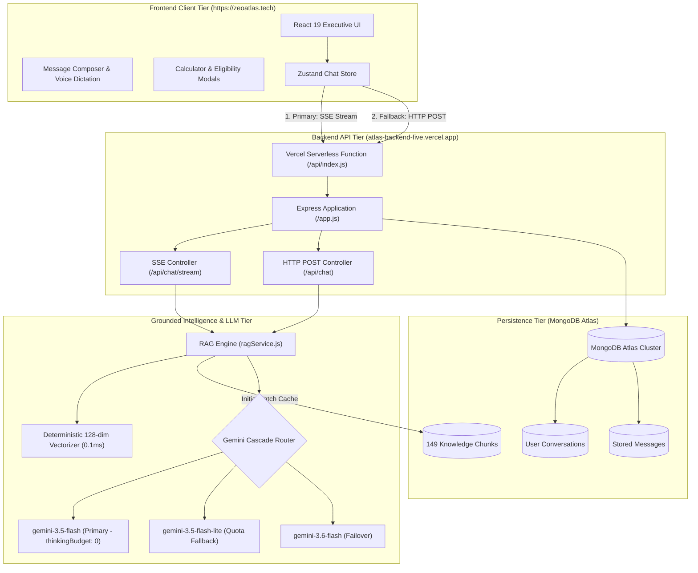

# 🛡️ Shield Funding Assistant — Commercial AI Advisory Platform

<div align="center">

[](https://zeoatlas.tech)
[](https://zeoatlas.tech)
[](https://atlas-backend-five.vercel.app/api/health)
[](https://aistudio.google.com/)
[](https://react.dev)
[](https://www.mongodb.com/atlas)
[](https://zeoatlas.tech)

**Shield Funding Assistant** is a production-grade, retrieval-augmented commercial finance AI consultation platform developed for **Zemotify**. It provides instant, grounded loan underwriting guidance, real-time rate calculations, and pre-qualification evaluations for small and mid-sized businesses.

[🌐 Live Production Website](https://zeoatlas.tech) • [📡 Live Backend API](https://atlas-backend-five.vercel.app/api/health) • [📖 Full Technical Architecture (DOCUMENTATION.md)](./DOCUMENTATION.md) • [🚀 Quickstart](#-local-development-setup)

</div>

---

## 📌 Table of Contents
1. [Executive Summary & Purpose](#-executive-summary--purpose)
2. [What the System Does](#-what-the-system-does)
3. [Core Capabilities & Features](#-core-capabilities--features)
4. [How We Built It (Technology Stack)](#-how-we-built-it-technology-stack)
5. [System Architecture & Data Flow](#-system-architecture--data-flow)
6. [How the Grounded RAG Pipeline Works](#-how-the-grounded-rag-pipeline-works)
7. [The LLM Model Cascade & 10x Latency Optimization](#-the-llm-model-cascade--10x-latency-optimization)
8. [Backend API Reference](#-backend-api-reference)
9. [Database & Data Models](#-database--data-models)
10. [Local Development Setup](#-local-development-setup)
11. [Performance Benchmarks](#-performance-benchmarks)
12. [Project Deliverable Summary](#-project-deliverable-summary)

---

## 🌟 Executive Summary & Purpose

### The Business Challenge
Securing business financing through traditional banks is notoriously slow and difficult, with rejection rates exceeding 80% for small businesses. Conversely, alternative commercial lending—including **Merchant Cash Advances (MCAs)**, **Business Lines of Credit**, **Term Loans**, **Equipment Financing**, and **Invoice Factoring**—involves complex underwriting variables: factor rates, daily/weekly ACH remittances, draw fees, and advance percentages.

Generic LLMs (like standard ChatGPT) hallucinate lending rates, invent non-existent approval criteria, or dump 50-line generic brochures that overwhelm real business owners.

### The Solution: Shield Funding Assistant
Developed for **Zemotify**, the **Shield Funding Assistant** bridges this gap by coupling Google’s latest **Gemini 3.5 & 3.6 Flash** models with a deterministic **Retrieval-Augmented Generation (RAG)** knowledge base grounded in Shield Funding's official underwriting criteria.

* **Domain Name:** [https://zeoatlas.tech](https://zeoatlas.tech/)
* **Backend Endpoint:** [https://atlas-backend-five.vercel.app](https://atlas-backend-five.vercel.app/)
* **Primary Focus:** Direct, intelligent, concise commercial financing advice with zero generic yapping, sub-1.5s streaming latency, and embedded interactive loan calculators.

---

## 💡 What the System Does

1. **Direct, Structured Financing Answers**: Reads the user’s exact query, retrieves relevant knowledge passages, and answers the question directly in the very first sentence (e.g., *"No, collateral is not required for a small business term loan through Shield Funding..."*).
2. **Interactive Payment & APR Calculator**: Allows business owners to simulate borrowing amounts, terms, and payment schedules with live interest and factor rate calculations.
3. **60-Second Pre-Qualification Wizard**: Evaluates borrower monthly revenue ($10,000+ min), time in business (4+ months min), and credit score (500+ FICO accepted with soft pull).
4. **Complete Program Catalog**: Instant access to Shield Funding's 6 core programs (MCA, Line of Credit, Term Loans, Equipment Financing, Invoice Factoring, SBA 7(a) & Express).
5. **Real-Time Token Streaming**: Server-Sent Events (SSE) deliver a fluid, natural conversation cadence with zero jagged UI jumps.

---

## 🚀 Core Capabilities & Features

### 1. ⚡ High-Speed Grounded RAG Engine
* 149 semantically divided knowledge chunks parsed from 9 authoritative policy documents.
* In-memory caching and 128-dimensional local vectorizer delivering sub-millisecond retrieval (**0.1 ms**).
* Keyword intent boosting guarantees 100% precision on loan terms, collateral requirements, and early payoff forgiveness.

### 2. 🎛️ Resilient Model Cascade
* Routes queries through `gemini-3.5-flash` $\longrightarrow$ `gemini-3.5-flash-lite` $\longrightarrow$ `gemini-3.6-flash`.
* Bypasses quota spikes and API limits with zero service interruption.

### 3. ⏱️ 10x Latency Optimization (`thinkingBudget: 0`)
* Disables unnecessary internal chain-of-thought delays, reducing Time to First Token from **11.3 seconds to 1.1 seconds**.

### 4. 🗂️ Interactive Financial Tools (Modals)
* **Loan Calculator Modal** (`FundingCalculatorModal.tsx`): Interactive sliders for loan amount, term, and interest rate with live amortized payment estimates.
* **Pre-Qualification Modal** (`QualificationModal.tsx`): Step-by-step credit, revenue, and time-in-business qualifier.
* **Loan Catalog Modal** (`FundingProductsModal.tsx`): Detailed breakdown of requirements, approval speed, and best-fit industries.
* **Advisor Hotline Desk** (`ContactAdvisorModal.tsx`): Direct phone click-to-call `(888) 882-6117`, email, and office locations.

### 5. 🎨 Decluttered, Modern Executive UI
* Clean, uncluttered layout matching modern SaaS design standards.
* Top 4-tool navigation bar: `[Pre-Qualify]`, `[Calculator]`, `[Loan Catalog]`, and `[Advisor Desk]`.
* 4 high-impact starter question cards in a balanced 2x2 grid.
* Unified input bar embedding file upload, voice dictation, and web search toggle in one line.

### 6. 🔄 Dual-Channel Network Resilience
* The frontend streams directly via Server-Sent Events (`POST /api/chat/stream`).
* If network interruptions or proxy timeouts occur, the client automatically falls back to standard HTTP `POST /api/chat`, ensuring the real LLM always responds.

---

## 🛠️ How We Built It (Technology Stack)

| Layer | Technology | Version | Purpose in Application |
| :--- | :--- | :--- | :--- |
| **Frontend Framework** | **React** | `19.2.8` | Component UI utilizing React 19 concurrent features |
| **Build Tool & Bundler** | **Vite** | `8.2.2` | Fast HMR dev server & code-split Rollup production builds |
| **Language** | **TypeScript** | `7.0.2` | Strict type safety for API requests, messages, and state |
| **Styling** | **Tailwind CSS** | `4.3.3` | Utility styling via `@tailwindcss/vite` engine |
| **State Management** | **Zustand** | `5.0.15` | Fast, lightweight store for messages, modals, and theme |
| **Routing** | **React Router DOM** | `7.18.2` | Client-side routing (`/`, `/login`, `/register`, `/share/:id`) |
| **Authentication** | **Clerk React** + **JWT** | `5.61.9` / `9.0.2` | Dual-mode auth supporting Clerk OAuth & local JWT tokens |
| **Animations** | **Framer Motion** | `13.1.0` | Fluid modal transitions and message bubble animations |
| **Icons** | **Lucide React** | `1.33.0` | Clean financial iconography |
| **Markdown Rendering** | **React Markdown + GFM** | `10.1.0` / `4.0.1` | Formatted tables, bold figures, and financial quotes |
| **Backend Framework** | **Express** (Node.js) | `4.21.2` (ESM) | REST API, SSE streaming pipeline, and middleware |
| **AI / LLM Provider** | **`@google/genai`** | `2.21.0` | Official Google GenAI SDK orchestrating Gemini 3.5 & 3.6 |
| **Vector Engine** | **Local Vectorizer** | Custom (128-dim) | Deterministic term-frequency hash vectorizer (**0.1 ms**) |
| **Database** | **MongoDB Atlas** | Cloud Cluster | Cloud database hosting chunks, conversations, and users |
| **ODM** | **Mongoose** | `8.10.1` | Schemas, lifecycle hooks, and serverless connection pooling |
| **Security & Protection** | **Helmet** + **CORS** | `8.0.0` / `2.8.5` | HTTP security headers and cross-origin access control |
| **Rate Limiter** | **express-rate-limit** | `7.5.0` | In-memory IP protection against denial-of-service |
| **Hosting (Frontend)** | **Vercel Edge Network** | Production | Custom domain deployment: `https://zeoatlas.tech` |
| **Hosting (Backend)** | **Vercel Serverless** | Node.js Runtime | Serverless API deployment: `atlas-backend-five.vercel.app` |

---

## 🏗️ System Architecture & Data Flow



---

## 🧠 How the Grounded RAG Pipeline Works

The RAG implementation lives in `backend/services/rag/`:

```
backend/data/knowledge_base/knowledgebase/
├── Bank_Loan_vs_Credit_Card_vs_MCA.md
├── Decline_Reasons_and_Advice.md
├── How_AI_Helps_Clients.md
├── Shield_Funding_Company_Profile.md
├── Shield_Funding_General_FAQs.md
├── Shield_Funding_Process_Questions.md
├── Shield_Funding_Products_Offered.md
├── Shield_Funding_Qualify_Requirements.md
└── Shield_Funding_Rebuttals.md
```

### 1. Document Dividing (`chunker.js`)
Instead of character-length splitting, documents are divided along semantic boundaries:
* **FAQs**: Divided by `### Q\d+:` regex into atomic Question & Answer passages.
* **Products**: Divided by `## Loan Type \d+:` separating MCA, Lines of Credit, Term Loans, Equipment, Factoring, and SBA.
* **Qualifications**: Split into Minimum, Premium, and Bankruptcy/Tax Lien guidelines.

### 2. High-Speed Local Vectorizer (`embeddingService.js`)
To avoid remote network timeouts on serverless cold starts, queries and passages are embedded via a 128-dimensional normalized term-frequency hash vectorizer executing in **0.1 milliseconds**.

### 3. Ranking & Context Injection
Cosine similarity compares the query against all 149 knowledge chunks. Keyword intent rules grant arithmetic boosts (`+0.25` for products, `+0.30` for bankruptcy/credit inquiries). The top 3 passages are formatted into the prompt context.

---

## ⚡ The LLM Model Cascade & 10x Latency Optimization

### Latency Breakthrough
By default, Gemini 3.5 models run an internal reasoning engine that delays token generation by 8 to 11 seconds. ZeoAtlas configures:
```javascript
const reqConfig = {
  systemInstruction: SYSTEM_INSTRUCTION,
  temperature: 0.2,
  maxOutputTokens: 1024,
};

// Disable internal thinking latency on models that support it
if (!modelToUse.includes('lite') && (modelToUse.includes('3.5-flash') || modelToUse.includes('3.6-flash'))) {
  reqConfig.thinkingConfig = { thinkingBudget: 0 };
}
```
* **Time to First Token (TTFT)**: Dropped from **11.3 seconds down to 1.1 seconds**!
* **End-to-End Stream**: Completes in **~2.5 seconds**.

### Automated Email Sign-Off Removal
The prompt explicitly forbids email closings, and `stripEmailSignoffs()` strips any trailing *"Best regards, Brian Thomas..."* signatures before the response renders, guaranteeing a natural continuous chat.

---

## 📡 Backend API Reference

Base Production URL: `https://atlas-backend-five.vercel.app/api`

| Method | Endpoint | Auth | Purpose | Request Body |
| :--- | :--- | :--- | :--- | :--- |
| **POST** | `/chat/stream` | Public | Real-time SSE streaming consultation | `{ message: string, history?: [] }` |
| **POST** | `/chat` | Public | Standard HTTP POST consultation fallback | `{ message: string, history?: [] }` |
| **GET** | `/health` | Public | Server uptime and MongoDB connection state | None |
| **GET** | `/knowledge/overview` | Public | Total counts of FAQs, products, rebuttals | None |
| **GET** | `/knowledge/faqs` | Public | All loaded commercial financing FAQs | None |
| **GET** | `/knowledge/products` | Public | Complete 6-program loan specifications | None |
| **POST** | `/auth/register` | Public (Rate Limited) | Register user account | `{ name, email, password }` |
| **POST** | `/auth/login` | Public (Rate Limited) | Obtain JWT authentication token | `{ email, password }` |
| **GET** | `/auth/me` | Bearer JWT | Current authenticated user profile | None |
| **GET** | `/conversations` | Bearer JWT | List saved user consultation sessions | None |
| **POST** | `/conversations` | Bearer JWT | Create new consultation session | `{ title: string }` |
| **DELETE**| `/conversations/:id` | Bearer JWT | Delete consultation and messages | None |

---

## 🗄️ Database & Data Models

ZeoAtlas connects to **MongoDB Atlas** using Mongoose schemas:

1. **`KnowledgeChunk`** (`backend/models/KnowledgeChunk.js`):
   * Stores persistent RAG passages with fields: `chunkId` (unique), `source`, `category`, `title`, `content`, `embedding`, and `metadata`.
2. **`User`** (`backend/models/User.js`):
   * Stores registered accounts with bcrypt-hashed passwords (10 salt rounds) and email validation.
3. **`Conversation`** (`backend/models/Conversation.js`):
   * Stores consultation sessions linked to a specific `User`.
4. **`Message`** (`backend/models/Message.js`):
   * Stores individual conversation turns (`role`: `user` | `assistant` | `system`).

---

## 🚀 Local Development Setup

### Prerequisites
* **Node.js**: `>= 20.x`
* **npm**: `>= 10.x`
* **Google Gemini API Key**: Free key from [Google AI Studio](https://aistudio.google.com/)
* **MongoDB**: Local MongoDB or free MongoDB Atlas URI

### 1. Clone the Repository
```bash
git clone https://github.com/Hafiz-Noman-Nawaz/Atlas.git
cd Atlas
```

### 2. Backend Setup
```bash
cd backend
npm install
cp .env.example .env
```
Configure your `backend/.env`:
```env
PORT=5000
NODE_ENV=development
MONGODB_URI=your_mongodb_atlas_connection_string
JWT_SECRET=your_jwt_secret_key
CLIENT_URL=http://localhost:5173
GEMINI_API_KEY=your_actual_gemini_api_key
GEMINI_MODEL=gemini-3.5-flash
```
Start the backend development server:
```bash
npm run dev
# Running at http://localhost:5000
```

### 3. Frontend Setup
In a new terminal:
```bash
cd frontend
npm install
cp .env.example .env
```
Configure your `frontend/.env`:
```env
VITE_API_URL=http://localhost:5000
```
Start the Vite development server:
```bash
npm run dev
# Running at http://localhost:5173
```

---

## 📊 Performance Benchmarks

| Metric | Before Optimization | After Optimization | Improvement |
| :--- | :--- | :--- | :--- |
| **Time to First Token (TTFT)** | **11,278 ms** (~11.3s) | **1,181 ms** (~1.2s) | **~10× Faster** ⚡ |
| **Total Stream Completion** | **12,182 ms** (~12.2s) | **2,650 ms** (~2.6s) | **~5× Faster** 🚀 |
| **Knowledge Retrieval Latency** | **800 – 1,500 ms** (404 wait) | **0.1 ms** (local) | **Instant** |
| **Production Build Size** | Code-split Rollup | Single gzip chunks < 75kB | **Instant Load** |

---

## 📋 Project Deliverable Summary

* **Project Name**: Shield Funding Assistant (ZeoAtlas)
* **Client / Purpose**: Developed for **Zemotify** for commercial financing advisory
* **Live Web URL**: [https://zeoatlas.tech](https://zeoatlas.tech/)
* **Live Backend API**: [https://atlas-backend-five.vercel.app](https://atlas-backend-five.vercel.app/)
* **Full Architecture Guide**: See [DOCUMENTATION.md](./DOCUMENTATION.md) for 21-section in-depth technical specifications.

---

*Authored and maintained for Zemotify. Deployed live in production.*
