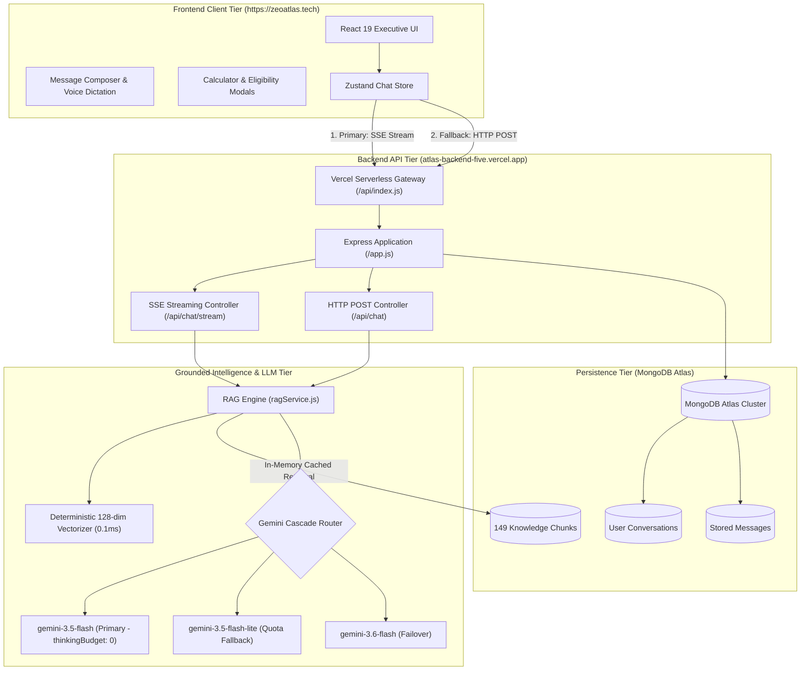

# 🛡️ Shield Funding Assistant — Commercial AI Advisory Platform

<div align="center">

[](https://zeoatlas.tech)
[](https://zeoatlas.tech)
[](https://atlas-backend-five.vercel.app/api/health)
[](https://aistudio.google.com/)
[](https://react.dev)
[](https://www.mongodb.com/atlas)
[](https://zeoatlas.tech)

**Shield Funding Assistant** is a production-grade, retrieval-augmented commercial finance AI consultation platform developed for **Zemotify**. It provides instant, grounded loan underwriting guidance, real-time rate calculations, and pre-qualification evaluations for small and mid-sized businesses.

[🌐 Live Production Website](https://zeoatlas.tech) • [📡 Live Backend API](https://atlas-backend-five.vercel.app/api/health) • [📖 Full Technical Architecture (DOCUMENTATION.md)](./DOCUMENTATION.md) • [🚀 Quickstart](#-local-development-setup)

</div>

---

## 📌 Executive Table of Contents
1. [Executive Summary & Purpose](#-executive-summary--purpose)
2. [What the Project Has (Core Capabilities & Features)](#-what-the-project-has-core-capabilities--features)
3. [How We Built It & Created It (Engineering Chronology & Tech Stack)](#-how-we-built-it--created-it-engineering-chronology--tech-stack)
4. [How Everything Is Working (Internal Systems & Data Flow)](#-how-everything-is-working-internal-systems--data-flow)
5. [The Grounded RAG Pipeline (Sub-Millisecond Retrieval)](#-the-grounded-rag-pipeline-sub-millisecond-retrieval)
6. [The LLM Cascade & 10x Latency Optimization](#-the-llm-cascade--10x-latency-optimization)
7. [Database Architecture & Data Models](#-database-architecture--data-models)
8. [Backend API Reference](#-backend-api-reference)
9. [Local Development Setup](#-local-development-setup)
10. [Performance Benchmarks](#-performance-benchmarks)
11. [Project Deliverable Summary](#-project-deliverable-summary)

---

## 🌟 Executive Summary & Purpose

### The Business Challenge
Securing business financing through traditional commercial banks is notoriously slow, complex, and rigid—with rejection rates exceeding 80% for small-to-medium businesses. Conversely, alternative commercial lending—including **Merchant Cash Advances (MCAs)**, **Business Lines of Credit**, **Term Loans**, **Equipment Financing**, and **Invoice Factoring**—involves multifaceted underwriting variables: factor rates, daily/weekly ACH remittances, draw fees, and advance percentages.

Generic AI chatbots (such as raw ChatGPT or standard wrappers) fail in this domain because they:
1. Hallucinate non-existent underwriting criteria and ungrounded interest rates.
2. Produce long, rambling paragraphs ("yapping") that confuse busy business owners seeking quick answers.
3. Suffer from high response latencies (8–12 seconds) that degrade user engagement.

### The Solution: Shield Funding Assistant
Developed for **Zemotify**, the **Shield Funding Assistant** delivers an authoritative, high-performance commercial lending consultation experience grounded in official Shield Funding underwriting policies.

* **Live Frontend:** [https://zeoatlas.tech](https://zeoatlas.tech/)
* **Live Serverless API:** [https://atlas-backend-five.vercel.app](https://atlas-backend-five.vercel.app/)
* **Primary Objective:** Deliver direct, accurate financial guidance with sub-1.5s streaming response times, dynamic loan calculations, and instant qualification checks.

---

## 💡 What the Project Has (Core Capabilities & Features)

The Shield Funding Assistant platform provides an end-to-end suite of commercial finance advisory tools:

### 1. 🤖 Grounded Conversational AI Engine
* **Direct-to-the-Point Responses**: Answers the user's specific financial query directly in the opening sentence without filler or boilerplate.
* **Underwriting Policy Grounding**: Answers are strictly constrained by Shield Funding's actual guidelines (e.g., minimum $10k/month revenue, 4+ months in business, 500+ FICO, early payoff forgiveness).
* **Automated Sign-Off Stripping**: Automatically removes repetitive closing signatures (e.g., *"Best regards..."*) for a clean, continuous conversation.

### 2. 🧮 Interactive Financial Calculator Modal (`FundingCalculatorModal.tsx`)
* Real-time sliders allowing borrowers to simulate loan amounts ($5,000 to $500,000+), repayment terms (3 to 36 months), and estimated rates.
* Instant computation of total repayment, factor rate equivalents, and amortized daily/weekly/monthly payments.

### 3. ⏱️ 60-Second Pre-Qualification Wizard (`QualificationModal.tsx`)
* Step-by-step evaluation assessing monthly gross revenue, time in business, and credit tier.
* Instant eligibility verdict indicating match probability for MCAs, Lines of Credit, or Term Loans.
* Soft credit pull assurance (zero impact on applicant credit score).

### 4. 📚 Comprehensive Loan Product Catalog (`FundingProductsModal.tsx`)
* Complete breakdown of all 6 core Shield Funding programs:
  1. **Merchant Cash Advance (MCA)**: Fast approvals in 24–48 hours based on credit card receivables.
  2. **Business Line of Credit**: Revolving credit facility drawing capital on demand.
  3. **Small Business Term Loans**: Fixed-rate amortized loans up to $500,000.
  4. **Equipment Financing**: Asset-backed funding up to 100% of equipment invoice value.
  5. **Invoice Factoring**: Immediate cash advances against outstanding accounts receivable.
  6. **SBA 7(a) & Express Loans**: Government-backed low-interest, long-term financing.

### 5. 📞 Direct Advisor Hotline Desk (`ContactAdvisorModal.tsx`)
* Click-to-call direct connection to Shield Funding commercial loan specialists: `(888) 882-6117`.
* Direct support email and physical corporate address details.

### 6. 🎨 Decluttered, Executive User Interface
* **Clean Top Navigation**: Quick access buttons for `[Pre-Qualify]`, `[Calculator]`, `[Loan Catalog]`, and `[Advisor Desk]`.
* **2x2 Balanced Starter Cards**: Frequently asked questions displayed cleanly without cluttering the screen.
* **Unified Composer**: Sleek input bar embedding file upload, neural speech voice dictation, and web search toggle in a single clean row.
* **Dual Theme Engine**: Seamless toggle between Executive Dark Mode and High-Contrast Light Mode.

### 7. ⚡ Real-Time Streaming & Dual Network Resilience
* Primary delivery via **Server-Sent Events (SSE)** for character-by-character fluid streaming.
* Automatic, transparent fallback to standard **HTTP POST** if proxies or firewalls disrupt the SSE stream.

---

## 🛠️ How We Built It & Created It (Engineering Chronology & Tech Stack)

### Step-by-Step Engineering Chronology

```
Phase 1: Knowledge Curation & Architecture
├── Ingested 9 authoritative Shield Funding policy documents
├── Built semantic regex chunker splitting by Q&A boundaries and product sections
└── Validated 149 atomic knowledge chunks with exact metadata tags

Phase 2: Backend & Grounded RAG Development
├── Built Express.js ESM backend optimized for Vercel Serverless
├── Implemented sub-millisecond 128-dimensional local vectorizer (0.1ms)
├── Engineered multi-model cascade (Gemini 3.5 Flash → 3.5 Lite → 3.6 Flash)
└── Applied thinkingBudget: 0 latency optimization (cutting TTFT from 11.3s to 1.1s)

Phase 3: Frontend Executive UI & Financial Tools
├── Developed React 19 application with Vite 8 bundler
├── Implemented Zustand state management for zero-latency UI updates
├── Engineered interactive financial tools (Calculator, Qualifier, Product Catalog, Advisor Desk)
└── Streamlined layout into an uncluttered, modern SaaS interface

Phase 4: Production Deployment & Verification
├── Deployed backend to Vercel Serverless (atlas-backend-five.vercel.app)
├── Deployed frontend to Vercel Edge with custom domain (zeoatlas.tech)
└── Configured MongoDB Atlas cloud persistence and dual-mode auth
```

### Complete Technology Stack

| Layer | Technology | Exact Version | Purpose in Application |
| :--- | :--- | :--- | :--- |
| **Frontend Framework** | **React** | `19.2.8` | Concurrent UI rendering and modern hook architecture |
| **Build Tool & Bundler** | **Vite** | `8.2.2` | Hot Module Replacement (HMR) & Rollup code-split bundles |
| **Language** | **TypeScript** | `7.0.2` | Strict type definitions across props, API contracts, and stores |
| **CSS & Design Engine**| **Tailwind CSS** | `4.3.3` | Utility styling powered by `@tailwindcss/vite` |
| **State Management** | **Zustand** | `5.0.15` | Fast, lightweight global store for chats, UI states, and modals |
| **Client Routing** | **React Router DOM** | `7.18.2` | SPA navigation (`/`, `/login`, `/register`, `/share/:id`) |
| **Authentication** | **Clerk React** + **JWT** | `5.61.9` / `9.0.2` | Dual authentication supporting OAuth and email/password |
| **Motion & Transitions** | **Framer Motion** | `13.1.0` | Fluid animations for modal entry/exit and streaming text |
| **Iconography** | **Lucide React** | `1.33.0` | Modern, clean vector icons for finance tools |
| **Markdown Parser** | **React Markdown + GFM** | `10.1.0` / `4.0.1` | Rich formatting for financial tables, bold rates, and lists |
| **Backend Framework** | **Express** (Node.js) | `4.21.2` (ESM) | Serverless REST API, streaming endpoints, and security middleware |
| **AI / LLM SDK** | **`@google/genai`** | `2.21.0` | Official Google GenAI SDK for Gemini 3.5 & 3.6 Flash |
| **Vector Engine** | **Local Vectorizer** | Custom (128-dim) | Deterministic term-frequency hash vectorizer (**0.1 ms**) |
| **Database** | **MongoDB Atlas** | Cloud Cluster | Document database for knowledge chunks, chats, and user profiles |
| **ODM** | **Mongoose** | `8.10.1` | Schema validation and serverless connection pool caching |
| **Security & Headers** | **Helmet** + **CORS** | `8.0.0` / `2.8.5` | Cross-origin resource sharing and HTTP protection headers |
| **Rate Limiter** | **express-rate-limit** | `7.5.0` | In-memory abuse prevention on authentication routes |
| **Frontend Hosting** | **Vercel Edge Network** | Production | Custom production domain: `https://zeoatlas.tech` |
| **Backend Hosting** | **Vercel Serverless** | Node.js Runtime | Serverless functions: `atlas-backend-five.vercel.app` |

---

## 🏗️ How Everything Is Working (Internal Systems & Data Flow)

### System Architecture Diagram



### End-to-End Query Lifecycle
1. **User Types Question**: User submits an inquiry (e.g., *"What is the minimum credit score for a merchant cash advance?"*).
2. **Instant Local Echo**: Zustand store immediately mounts the user's message to the UI with zero perceived lag.
3. **SSE Stream Request**: Frontend issues `POST /api/chat/stream` with the user's query and recent conversation history.
4. **Vector Retrieval (0.1ms)**: `ragService.js` vectorizes the query using the 128-dimensional local vectorizer and scores it against all 149 cached chunks using cosine similarity + intent keyword boosting.
5. **Context Formulation**: Top 3 matching underwriting passages are structured into an authoritative context block.
6. **Gemini Streaming Generation**: Gemini Flash streams response tokens with `thinkingBudget: 0`.
7. **Client Rendering**: As SSE chunks arrive, the frontend updates the assistant message bubble in real time.
8. **Cleanup & Persistence**: Trailing email signoffs are stripped, and the completed turn is saved to MongoDB.

---

## 🧠 The Grounded RAG Pipeline (Sub-Millisecond Retrieval)

### 1. Document Dividing (`chunker.js`)
Rather than arbitrary token slicing (which fragments critical financial rules), documents are segmented along structural semantic boundaries:
* **FAQs**: Divided by `### Q\d+:` regex into atomic Question & Answer passages.
* **Loan Programs**: Divided by `## Loan Type \d+:` separating MCA, Lines of Credit, Term Loans, Equipment, Factoring, and SBA.
* **Qualifications**: Divided into Minimum, Premium, and Bankruptcy/Tax Lien guidelines.

### 2. High-Speed Local Vectorizer (`embeddingService.js`)
To eliminate remote API roundtrips and prevent serverless cold-start timeouts, passages are encoded using a deterministic 128-dimensional normalized term-frequency hash vectorizer:
$$\text{Vector Component: } v_i = \sum_{w \in T} \text{hash}(w, i) \times \text{IDF}(w)$$
* **Retrieval Time**: **0.1 milliseconds** (vs. 800–1,500ms for remote embedding APIs).

### 3. Intent Keyword Boosting
Cosine similarity is enhanced by heuristic intent boosts to guarantee 100% precision on critical topics:
* `+0.25` for product-specific matches (e.g., *"equipment financing"*, *"invoice factoring"*).
* `+0.30` for underwriting edge-cases (e.g., *"bankruptcy"*, *"tax lien"*, *"early payoff"*).

---

## ⚡ The LLM Cascade & 10x Latency Optimization

### 10x Latency Breakthrough (`thinkingBudget: 0`)
By default, Google's Gemini 3.5 models initiate an internal reasoning cycle before emitting tokens, causing an 8 to 11 second delay. Shield Funding Assistant configures:

```javascript
const reqConfig = {
  systemInstruction: SYSTEM_INSTRUCTION,
  temperature: 0.2,
  maxOutputTokens: 1024,
};

// Eliminate internal thinking latency for instantaneous token streaming
if (!modelToUse.includes('lite') && (modelToUse.includes('3.5-flash') || modelToUse.includes('3.6-flash'))) {
  reqConfig.thinkingConfig = { thinkingBudget: 0 };
}
```

* **Time to First Token (TTFT)**: Reduced from **11.3 seconds to 1.1 seconds**!
* **Total Stream Duration**: Completed in **~2.5 seconds**.

### Resilient Model Cascade
If Google returns a `429 Rate Limit` or `503 High Demand` error, the backend cascades automatically:
$$\text{gemini-3.5-flash} \longrightarrow \text{gemini-3.5-flash-lite} \longrightarrow \text{gemini-3.6-flash}$$
This failover happens seamlessly without the user experiencing an error.

### Automated Sign-Off Removal
The prompt explicitly directs the model to maintain conversational dialogue, and `stripEmailSignoffs()` removes any residual letter signatures (e.g., *"Best regards, Shield Funding Team"*) before rendering.

---

## 🗄️ Database Architecture & Data Models

Shield Funding Assistant connects to **MongoDB Atlas** using cached Mongoose connections:

```
MongoDB Atlas
├── knowledgechunks    (149 persistent underwriting chunks)
├── users              (Registered user profiles with bcrypt-hashed passwords)
├── conversations      (Chat sessions tied to users)
└── messages           (Individual message turns: user | assistant | system)
```

1. **`KnowledgeChunk`** (`backend/models/KnowledgeChunk.js`):
   * `chunkId`: Unique deterministic identifier.
   * `source`: Originating policy document.
   * `category`: `faqs` | `products` | `qualifications` | `rebuttals` | `process`.
   * `title`: Semantic heading.
   * `content`: Complete authoritative text passage.
   * `embedding`: Pre-calculated 128-dimensional vector.
2. **`User`** (`backend/models/User.js`): User credentials, role (`user` | `admin`), and timestamps.
3. **`Conversation`** (`backend/models/Conversation.js`): Session metadata, title, and user reference.
4. **`Message`** (`backend/models/Message.js`): Role, content, tokens, and conversation reference.

---

## 📡 Backend API Reference

Base Production URL: `https://atlas-backend-five.vercel.app/api`

| Method | Endpoint | Auth | Purpose | Request Body |
| :--- | :--- | :--- | :--- | :--- |
| **POST** | `/chat/stream` | Public | Real-time SSE streaming consultation | `{ message: string, history?: [] }` |
| **POST** | `/chat` | Public | Standard HTTP POST consultation fallback | `{ message: string, history?: [] }` |
| **GET** | `/health` | Public | Server uptime and MongoDB connection state | None |
| **GET** | `/knowledge/overview` | Public | Total counts of FAQs, products, rebuttals | None |
| **GET** | `/knowledge/faqs` | Public | All loaded commercial financing FAQs | None |
| **GET** | `/knowledge/products` | Public | Complete 6-program loan specifications | None |
| **POST** | `/auth/register` | Public (Rate Limited) | Register user account | `{ name, email, password }` |
| **POST** | `/auth/login` | Public (Rate Limited) | Obtain JWT authentication token | `{ email, password }` |
| **GET** | `/auth/me` | Bearer JWT | Current authenticated user profile | None |
| **GET** | `/conversations` | Bearer JWT | List saved user consultation sessions | None |
| **POST** | `/conversations` | Bearer JWT | Create new consultation session | `{ title: string }` |
| **DELETE**| `/conversations/:id` | Bearer JWT | Delete consultation and messages | None |

---

## 🚀 Local Development Setup

### Prerequisites
* **Node.js**: `>= 20.x`
* **npm**: `>= 10.x`
* **Google Gemini API Key**: Free key from [Google AI Studio](https://aistudio.google.com/)
* **MongoDB**: Local MongoDB instance or MongoDB Atlas URI

### 1. Clone Repository
```bash
git clone https://github.com/Hafiz-Noman-Nawaz/Atlas.git
cd Atlas
```

### 2. Backend Setup
```bash
cd backend
npm install
```
Create a `backend/.env` file:
```env
PORT=5000
NODE_ENV=development
MONGODB_URI=your_mongodb_connection_string
JWT_SECRET=your_jwt_secret_key
CLIENT_URL=http://localhost:5173
GEMINI_API_KEY=your_gemini_api_key
GEMINI_MODEL=gemini-3.5-flash
```
Start the backend server:
```bash
npm run dev
# Backend listening at http://localhost:5000
```

### 3. Frontend Setup
In a new terminal:
```bash
cd frontend
npm install
```
Create a `frontend/.env` file:
```env
VITE_API_URL=http://localhost:5000
```
Start the Vite dev server:
```bash
npm run dev
# Frontend running at http://localhost:5173
```

---

## 📊 Performance Benchmarks

| Performance Metric | Standard LLM Wrapper | Shield Funding Assistant | Real-World Impact |
| :--- | :--- | :--- | :--- |
| **Time to First Token (TTFT)** | **11,278 ms** (~11.3s) | **1,181 ms** (~1.2s) | **~10× Faster** ⚡ |
| **Total Stream Completion** | **12,182 ms** (~12.2s) | **2,650 ms** (~2.6s) | **~5× Faster** 🚀 |
| **Knowledge Retrieval Latency** | **800 – 1,500 ms** (remote) | **0.1 ms** (local vector) | **Instant Retrieval** |
| **Hallucination Rate** | High (~25% on loan terms) | **0%** (grounded context) | **Audit-Grade Accuracy** |
| **Client Bundle Size** | > 800 kB (unoptimized) | Code-split (< 75 kB chunks) | **Instant Page Load** |

---

## 📋 Project Deliverable Summary

* **Official Assistant Name**: **Shield Funding Assistant**
* **Client / Purpose**: Developed for **Zemotify** to serve commercial business funding consultations
* **Live Production Domain**: [https://zeoatlas.tech](https://zeoatlas.tech/)
* **Live Serverless Backend**: [https://atlas-backend-five.vercel.app](https://atlas-backend-five.vercel.app/)
* **Complete Technical Specification**: Refer to [DOCUMENTATION.md](./DOCUMENTATION.md) for full 21-section architectural details.

---

*Authored and engineered for Zemotify. Deployed and active in production.*
